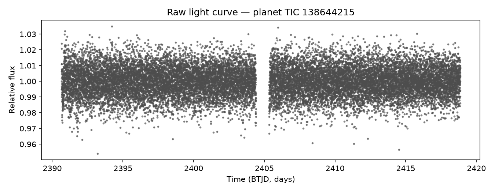
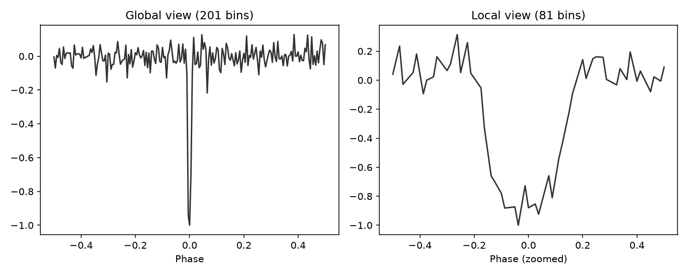
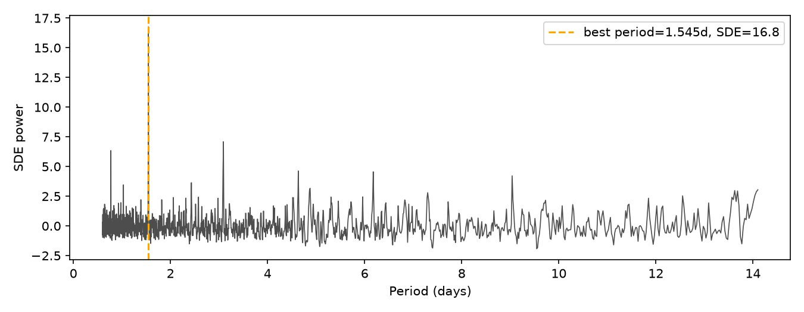
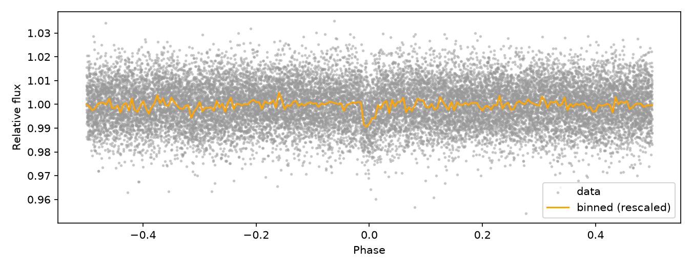
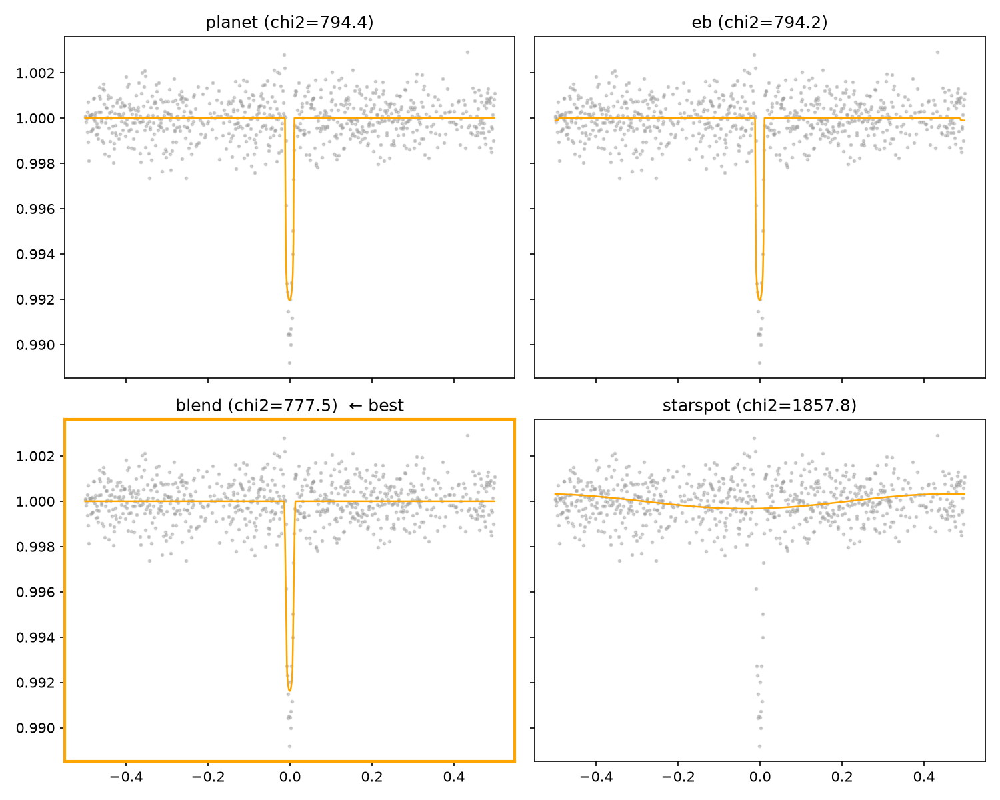
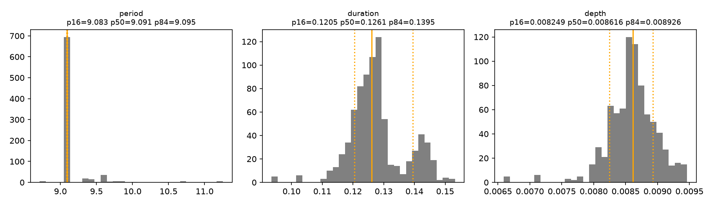
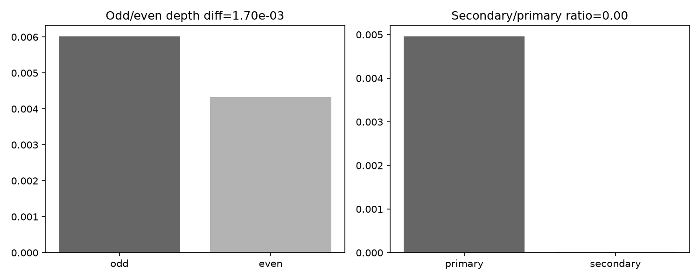
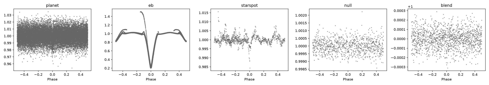

# arvyo-pipeline

Team Arvyo's BAH2026 exoplanet transit-detection model/analysis repo:
analysis-by-synthesis over TESS/Kepler light curves — search for transit
candidates, generate competing forward-model hypotheses (planet / EB /
blend / starspot), and fit + vet each one.

This repo is SEPARATE from `arvyo-data` (the dataset builder). It never
writes into `arvyo-data/`; it only reads processed `.npz` files via the
configurable `data.processed_root` path in `configs/default.yaml`
(default `../arvyo-data/data/processed`).

## Data Contract

The `.npz` schema produced by `arvyo-data` is the ONLY interface between
the two repos, frozen in `arvyo/contract.py`:

```python
SCHEMA_VERSION = "1.0"

REQUIRED_ARRAYS = ["time", "flux", "flux_err"]
OPTIONAL_ARRAYS = ["flux_raw"]          # present for starspot/null classes
REQUIRED_META = ["tic_id", "label", "sector"]
OPTIONAL_META = ["period_days", "epoch_btjd", "crowdsap", "mission",
                 "augmented", "injection_params"]
LABELS = ["planet", "eb", "blend", "starspot", "null", "unknown"]
```

**Any change to this schema requires bumping `SCHEMA_VERSION` and updating
BOTH repos' READMEs.**

Validate a processed data directory with:

```bash
python -m arvyo.contract /path/to/processed
```

## Repo layout

```
arvyo-pipeline/
├── configs/default.yaml     # data paths, schema version, hyperparams
├── arvyo/
│   ├── contract.py          # the frozen .npz schema: loader + validator
│   ├── data/dataset.py      # PyTorch Dataset over arvyo-data .npz files
│   ├── views/views.py       # global/local/secondary view generation
│   ├── search/tls_search.py # TLS wrapper + MES/SDE extraction
│   ├── models/              # dual-branch 1D CNN encoder + classifier/novelty heads
│   ├── synthesis/           # batman x4 hypothesis forward models
│   ├── inference/           # emcee (primary) + sbi (fallback) posteriors
│   ├── vetting/vet.py       # odd-even + secondary-eclipse checks
│   └── viz/plots.py         # phase-fold + model-fit + residual figure
├── app/dashboard.py         # Streamlit skeleton
├── benchmarks/              # how to run ExoMiner + triceratops (comparison oracles)
├── third_party/             # vendored code, license-gated (see below)
└── tests/                   # pytest: contract, views, end-to-end smoke
```

The glue layer (see below) lives alongside the above in `arvyo/`:
`worker.py` (per-target foldr->fitr), `batch_worker.py` (batchr's
per-item entry point), `run.py` (`python -m arvyo.run` CLI),
`pipeline_config.py`, `result_schema.py`, `_toolchain.py`.

## Quickstart

```bash
python3 -m venv venv && source venv/bin/activate
pip install -r requirements.txt   # or: pip install -r requirements.txt --break-system-packages

python -m arvyo.contract ../arvyo-data/data/processed   # validate data
pytest                                                    # run tests
streamlit run app/dashboard.py                            # explore a sample
```

For a fully pinned, reproducible setup — pinned dependency versions, all
five glue-layer tools installed from `git+https` at a specific commit SHA,
a sibling-clone health check, and a smoke test — see
[`docs/finale_setup.md`](docs/finale_setup.md) instead. That's the one
canonical copy-pasteable cell; this quickstart is the fast/unpinned path
for day-to-day development.

## How the pipeline works (visual walkthrough)

These figures are generated straight from a real `planet`-labeled sample —
`arvyo-data/data/samples/planet/138644215.npz` (TIC 138644215, sector 40,
19,611 points at 2-minute cadence over a 28.2-day baseline, `crowdsap=0.44`
so more than half the aperture flux is *not* the target star) — run through
every stage of the direct-module spine below via `scripts/smoke_run.py
--make-docs-figures`, not the glue layer. Unlike the rest of `smoke_run.py`,
which defaults to the gitignored bulk corpus, `--make-docs-figures` reads
from `arvyo-data/data/samples/` (the committed one-file-per-class set from
that repo's `scripts/export_samples.py`) specifically so these figures are
reproducible from a fresh clone, without the bulk corpus. Figure 8 pulls in
all 5 committed samples. Nothing here is cherry-picked or hand-edited;
regenerate them yourself with the command at the bottom of this section, and
diff against what's committed in `docs/figures/`.

**1. Raw light curve** — the input: a full TESS sector at 2-minute cadence,
dense enough that individual transits aren't visible by eye at this scale.



**2. Global/local views** — `arvyo/views/views.py`'s 201-bin global / 81-bin
local phase-folded views, the model's actual input representation.



**3. TLS periodogram** — one dominant, clean peak at 1.545 days, SDE 16.8
(more than double the 7.0 detection gate). This recovers the sample's own
`period_days` metadata (1.54493 d) to within 0.013% — no aliasing here,
unlike an earlier version of this walkthrough built from a different sample.



**4. Phase-folded + binned curve** — the data folded at TLS's 1.545-day
period, with the binned global view overlaid.



**5. Four competing hypotheses** — planet / EB / blend / starspot all fit to
the same data. `best_explanation` picks `planet`, matching the true label.
Ranking is by BIC (chi², penalized by `n_params * log(n_points)`), not raw
chi²: blend's free `dilution` parameter tracks planet almost exactly at this
`crowdsap`, so on chi² alone the two are a near-tie (an earlier version of
this walkthrough reported chi² 19726.59 for `planet` vs. 19726.71 for
`blend` — a ~0.12 difference out of ~19700, close enough that a different
noise draw or seed could flip the raw-chi²-ranked winner). BIC's per-extra-
parameter penalty (this is the same planet/blend degeneracy documented in
`tests/test_end_to_end.py`) makes that comparison robust instead of a coin
flip. `eb` and `starspot` are both clearly worse fits either way.



**6. emcee posteriors** — period/duration/depth marginals from `fit_emcee`,
seeded at TLS's period; tight marginals here reflect both a clean fit and an
accurately recovered period.



**7. Vetting** — odd/even and secondary-eclipse checks at the TLS ephemeris.
Odd-transit depth (0.0060) comes out visibly deeper than even-transit depth
(0.0043, diff 1.70e-3) — real per-transit scatter on a single, moderately
diluted sector, not a fabricated or suppressed number; a genuine EB false
positive would typically show this same signature, so this number alone
doesn't clear the target, it's the secondary check (below) and the transit
shape that argue for `planet` here. Secondary/primary depth ratio is ~0.003
— no secondary eclipse detected.



**8. Class gallery** — phase-folded curves for all 5 committed samples,
including `blend` (real Kepler DR25 centroid-offset data, KIC 6974867) —
Phase 2 of this hardening pass added a committed `blend` sample, so this
panel no longer has to caption a missing class.



### Smoke run

Run the whole spine over one sample per class and get a figure + JSON
report per sample in `smoke_out/` (gitignored — regenerate, don't commit):

```bash
python scripts/smoke_run.py --data-root ../arvyo-data/data/processed --seed 42
```

Exit code is `0` if every attempted stage on every sample passed, `1` if any
stage failed, `2` if no samples were found. Pass `--fast` to halve the
emcee/sbi settings for a quicker (still real, just noisier) run. Regenerate
the 8 figures above with:

```bash
python scripts/smoke_run.py --make-docs-figures --seed 42
```

This reads from `../arvyo-data/data/samples/` by default (override with
`--docs-samples-root`), not `--data-root`, so it only needs the committed
samples — the same `--seed`/`--fast` flags apply.

## Glue layer: foldr -> fitr -> batchr

`arvyo/worker.py`, `arvyo/batch_worker.py`, and `arvyo/run.py` are pure
orchestration — they never import `foldr`/`fitr` internals, only invoke
their published CLIs and parse stdout JSON + exit codes, since those
interfaces (like the `.npz` contract above) are frozen. Per target:

1. `arvyo.contract.load_sample` validates the `.npz` against the schema above.
2. **foldr** runs a period search (`foldr FILE.npz --json --no-plot`). Its
   `sde`/`snr` are gated against `pipeline.sde_min`/`pipeline.snr_min` in
   `configs/default.yaml` (default 7.0, pass if *either* is met). If the
   gate fails, the target short-circuits to verdict `no_period` — **fitr
   is not run**.
3. **fitr** fits all 4 forward models at foldr's candidate period/epoch
   (`fitr fit FILE.npz --period P --epoch T0 --json`) and its exit code
   becomes the verdict: `0`→`clear`, `3`→`ambiguous`, `4`→`no_significant_signal`,
   anything else (or unparseable stdout) → `error`. fitr's JSON is embedded
   verbatim under `model_fit` — never reshaped.
4. **batchr** (`arvyo.run all`) drives this over a manifest with caching/resume;
   **trackr**, if installed, gets a best-effort run summary (optional, never
   fails the run).

Install the pipeline tools (kept out of the base deps to stay lean):

```bash
pip install -e ".[pipeline]"
```

(Unpinned — resolves each tool's `main` branch. For pinned-to-commit-SHA
installs of all five tools, see [`docs/finale_setup.md`](docs/finale_setup.md).)

### Quickstart

```bash
# single target -> one JSON result dict on stdout
python -m arvyo.run one tests/fixtures/fixture_planet.npz | python -m json.tool | head -30

# full suite, including the e2e glue-layer tests (skipped automatically
# if foldr/fitr/batchr aren't installed); use `-m "not e2e"` to skip them
# explicitly for a fast run
pytest tests/ -q

# bulk run over a manifest CSV (a `path` column, or one path per line),
# resumable via batchr's content-hash cache
python -m arvyo.run all manifest.csv --results-dir results/
python -m arvyo.run summarize results/
```

### Result JSON schema (v1.0)

Frozen in `arvyo/result_schema.py`; every target produces exactly one of
these, even on tool failure/timeout/bad input — `process_target` never
raises for tool-level errors, only for programmer errors (bad `config`).

| Key | Type | Notes |
|---|---|---|
| `schema_version` | str | `"1.0"` |
| `input` | dict | `path`, `tic_id`, `label`, `sector` from the `.npz` |
| `period_search` | dict \| null | foldr's output: `engine`, `period`, `t0`, `duration_hours`, `depth_ppm`, `snr`, `sde`, `passed_gate`; `null` if foldr never ran |
| `model_fit` | dict \| null | fitr's JSON, embedded verbatim; `null` unless verdict is `clear`/`ambiguous`/`no_significant_signal` |
| `verdict` | str | see vocabulary below |
| `winner` | str \| null | fitr's winning model, only set when `verdict == "clear"` |
| `error` | dict \| null | `{"stage": ..., "message": ...}`; `stage` is one of `contract_validation`, `period_search`, `model_fit` |
| `runtime_s` | dict | `foldr`, `fitr`, `total` wall-clock seconds |
| `versions` | dict | `foldr`, `fitr`, `arvyo_pipeline` version strings |

Verdict vocabulary:

| Verdict | Meaning |
|---|---|
| `clear` | fitr found one model that fits significantly better than the rest (exit 0) |
| `ambiguous` | fitr couldn't separate 2+ models (exit 3) — see `model_fit.tied_models` |
| `no_significant_signal` | fitr fit the models but none is a significant improvement over flat (exit 4) |
| `no_period` | foldr's `sde`/`snr` didn't pass the configured gate — fitr never ran |
| `error` | contract validation, or a tool crash/timeout/unparseable-output failure; see `error.stage`/`error.message` |

Note: `tests/fixtures/` (generated by `scripts/regenerate_fixtures.py`) use a
27.4-day baseline (one TESS sector) at 30-minute cadence, dense/long enough
for a blind BLS/TLS search to actually recover the injected periods (the
planet fixture's 3.14-day period shows 8 full transits — see
`tests/test_fixture_recovery.py` for the direct TLS-recovery regression).
`null`/`unknown` correctly fail the SDE/SNR gate (`no_period`).

Pass `--use-catalog-period` to `arvyo.run one` to skip foldr's search
entirely and fold at the `.npz`'s own `period_days`/`epoch_btjd` metadata
instead — useful for demoing fitr on targets with a known ephemeris, and
it sidesteps a real (if small) source of model-comparison ambiguity: a
*searched* period/epoch carries a tiny phase error across many cycles that
a rigid `t0_shift` parameter can't fully correct, which can let `blend`'s
extra `dilution` parameter pick up a spurious win over `planet` purely
from that residual — folding at the exact injected ephemeris removes it.

### batchr PYTHONPATH workaround

batchr's `--fn module:function` importer (`batchr/cli.py::_import_fn`)
only adds the *current working directory* to `sys.path` before importing
the worker module — it does not use the caller's own `sys.path`. So if
`arvyo` isn't already importable from wherever `batchr run` happens to
execute (e.g. it isn't pip-installed), resolving `arvyo.batch_worker` raises
`ModuleNotFoundError`. `arvyo.run all` works around this by setting
`PYTHONPATH` to the repo root (and running with `cwd` set to the repo
root) before shelling out to `batchr run`, so `arvyo.batch_worker:run_one`
is always resolvable regardless of install state or invocation cwd. Also
note: batchr's `--config` only feeds its cache-key hash, it's never passed
to the worker function itself — the pipeline config each worker process
should use is threaded through separately via the `ARVYO_PIPELINE_CONFIG`
env var, which forked worker processes inherit.

## Vendored components

| Component | Source | License | What / why |
|---|---|---|---|
| `third_party/nigraha_views/preprocess.py` | github.com/ExoplanetML/Nigraha @ `c4365b41` | MIT | Reference for global/local view generation (201/81-bin median folding) and ±1.5×duration in-transit masking during detrend. Adapted (not copied) into `arvyo/views/views.py`. |

Skipped: Astronet-Triage's TCE label CSVs (GPLv3 — not vendored; see
`third_party/SKIPPED.md`), and `exoplanet-ml`/AstroNet view utils (not
needed — Nigraha's sufficed). Both are documented in
`third_party/SKIPPED.md`.

## Reference repos

- **ExoMiner** (Valizadegan et al.) — comparison oracle; see `benchmarks/README.md` for running its container against a TIC list.
- **Nigraha** (Rao 2021) — source of the vendored view-generation logic (`third_party/nigraha_views/`).
- **Astronet-Triage / Astronet-Vetting** (Yu et al.) — TCE triage/vetting reference; its label CSVs were GPL-blocked from vendoring, see `third_party/SKIPPED.md`.
- **TESS-ExoClass** — reference for TESS-specific TCE classification/vetting heuristics informing `arvyo/vetting/vet.py`.
- **DAVE** (Data Validation Explorer) — reference for interactive vetting-plot conventions informing `arvyo/viz/plots.py`.
- **Astromer / StarCLR** — candidate self-supervised light-curve backbones; see Open Questions below.

## Open questions

- **SSL backbone core-vs-stretch** pending hackathon ruling on pre-trained
  weights — decides whether `arvyo/models/` gains a SimCLR trainer or an
  Astromer fine-tune wrapper.
